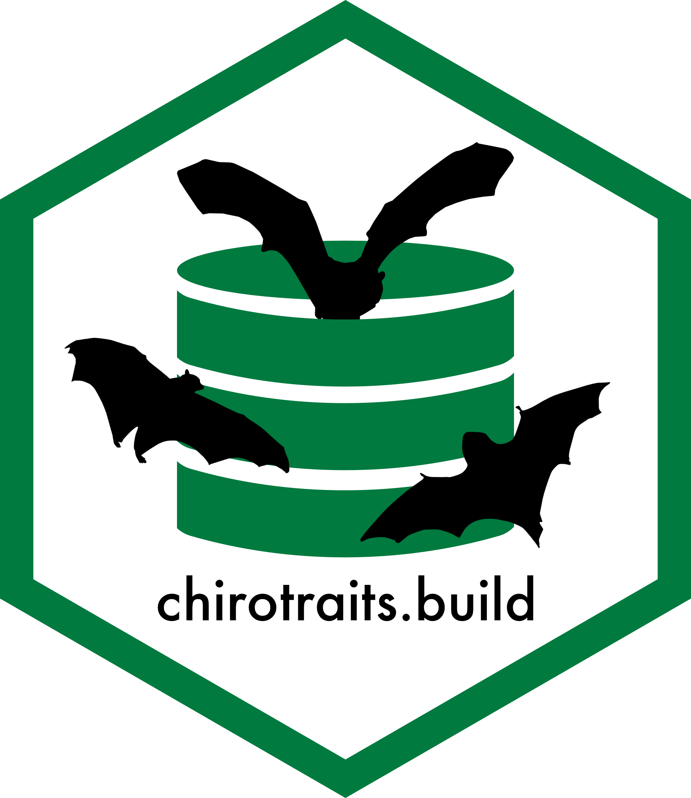

# `chirotraits.build` 

Source repository to build the `ChiroTraits` database.

## Overview

This repository compiles the code and data used to build the ChiroTraits database. This database is part of the first chapter of the PhD thesis "*Assessment of knowledge gaps in bats: A macroecological perspective*" which is being carried out by [Roberto Antonio Ruiz-Ramírez](https://maevolab.mx/authors/roberto/) at the [Evolutionary Macroecology Lab](https://maevolab.mx/).

This database is a work in progress maintained by Roberto A. Ruiz-Ramírez. If you have any questions or inquiries regarding the use of this document, please write to: [roberto.ruiz\@posgrado.ecologia.edu.mx](mailto:roberto.ruiz@posgrado.ecologia.edu.mx).

A detailed report of the data, methodology, and references used for the trait selection and literature review process can be found in the following [Quarto document](https://robertoruizr.github.io/GBTD_litrev_traitcat_cleaning/).

# The ChiroTraits database

Write description of the database, also the motivation for its creation.

Add the relevance of the traits.build and MDD 2.2 releases for the creation of the database.

The creation of `Chirotraits` was greatly pushed forward thanks to two recent releases: the traits.build R package (Wenk et al., 2024) and the [Mammal Diversity Database 2.1 (2025)](https://www.mammaldiversity.org/).

## File organization

### /config folder

The database is built using the following files, which can be found in the **/config** folder:

-   *metadata.yml*: Contains the database description, authors, and affiliations.
-   *traits.yml*: Contains the definitions of the traits included in the database.
-   *taxon_list.csv*: Contains the taxon names to be included in the database.
    -   Obtained from the [Mammal Diversity Database 2.1](https://www.mammaldiversity.org/)
-   *unit_conversions.csv*: Contains common unit conversion formulas.

### /data folder

The /data folder contains the individual publications included in this database. Each publication is in a folder named **FirstAuthor_YearofPublication**, and in each of those the following files are included:

-   *data.csv*: A csv file with the trait data from the publication.
-   *metadata.yml*: Metadata from the individual study. Includes publishing information, names and description of the included traits, as well as methods and context from the study.

## Taxonomic and trait coverage

The taxonomy used was obtained from the most recent version of [The Mammal Diversity Database (MDD)](https://www.mammaldiversity.org/), which recognises 1492 species, 238 genera, and 21 families of bats. Currently, `ChiroTraits` includes 64010 records for 1295 bat species and 29 functional traits.

*Add table with trait coverage per family in ChiroTraits*

### Taxonomic updates

When the species listed in the trait data was out of alignment with the taxonomy used, a taxonomic update was specified in the corresponding metadata.yml file of the study.

Each taxonomic update has the following structure: 
- *Find*: The species name reported in the source. 
- *Replace*: The current accepted species name, as established in the MDD. 
- *Reason*: The reason listed for the change in the correponding page for the species. Also includes the current webpage for the species listed in the MDD website.

*Add table with taxonomic updates in ChiroTraits*

## Trait definitions

Every functional trait included in `ChiroTraits` has a corresponding definition in the config/traits.yml file, which acts as a thesaurus for the complete database. Each trait includes their assigned name, definition, allowed values (numerical variables) or levels (categorical variables), expected unit, and a link to an existing Ontology found in the [Ontobee Data Server](https://ontobee.org/). When a trait definition was not found in the existing ontologies, the definition was obtained from a published trait dataset for bats (e.g. EuroBaTrait, Froidevaux et al., 2023; AfroBat, Cosentino et al., 2023) and the corresponding DOI was added as a source.

## Excluded data

Data was excluded from integration into `ChiroTraits` if: 
- The data value falls out of the allowed value range specified for the trait (e.g. a tail length of 0 mm). 
- Data which could not be mapped into a species (e.g. record is specified at genus level). 
- The data corresponds to an extinct bat species. In which case, a link to the corresponding entry in the [REPAD: The Recently Extinct Plants and Animals Database](https://recentlyextinctspecies.com/chiroptera) was added. 
- The data record was imputed by statistical methods (e.g. gap-filling).

## References
      
- Cosentino, F., Castiello, G., & Maiorano, L. (2023). A dataset on African bats’ functional traits. Scientific Data, 10(1), 623. https://doi.org/10.1038/s41597-023-02472-w
- Froidevaux, J. S. P., Toshkova, N., Barbaro, L., Benítez-López, A., Kerbiriou, C., Le Viol, I., Pacifici, M., Santini, L., Stawski, C., Russo, D., Dekker, J., Alberdi, A., Amorim, F., Ancillotto, L., Barré, K., Bas, Y., Cantú-Salazar, L., Dechmann, D. K. N., Devaux, T., … Razgour, O. (2023). A species-level trait dataset of bats in Europe and beyond. Scientific Data, 10(1), 253. https://doi.org/10.1038/s41597-023-02157-4  
- Mammal Diversity Database. (2025). Mammal Diversity Database (Version 2.0) [Data set]. Zenodo. https://doi.org/10.5281/zenodo.15007505
- Wenk, E., Bal, P., Coleman, D., Gallagher, R., Yang, S., & Falster, D. (2024). Traits.build: A data model, workflow and R package for building harmonised ecological trait databases. Ecological Informatics, 83, 102773. https://doi.org/10.1016/j.ecoinf.2024.102773

## License

The contents of this repository are made available under the Open Data Commons Attribution License (ODC-By): http://opendatacommons.org/licenses/by/1.0/